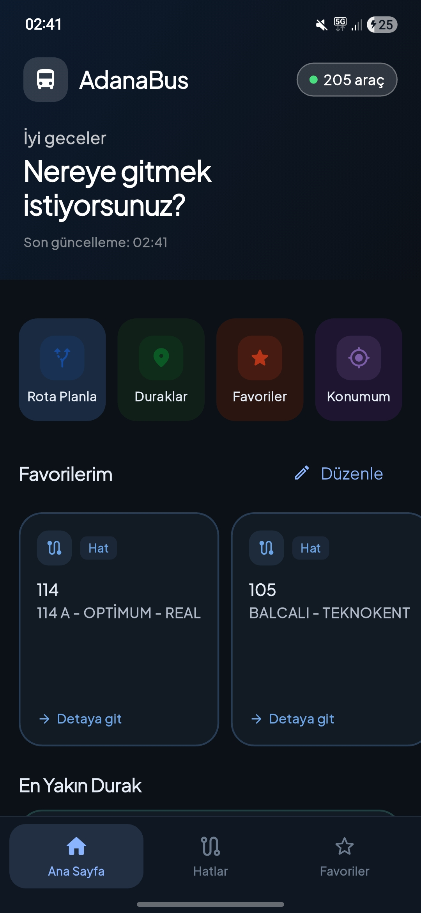
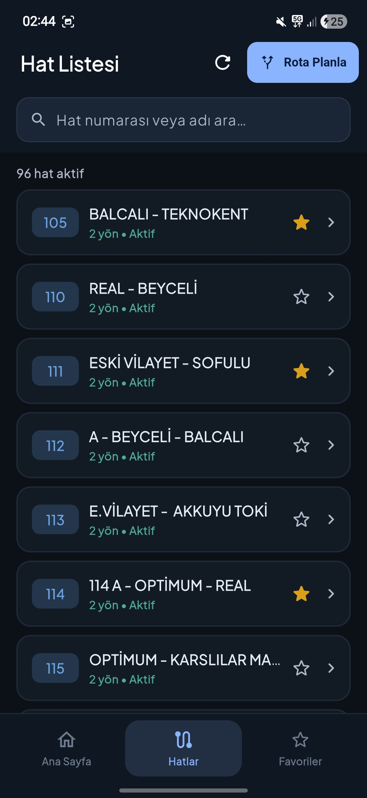
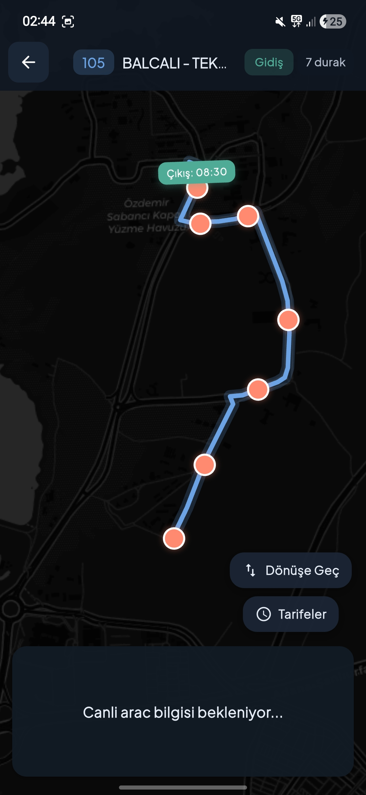
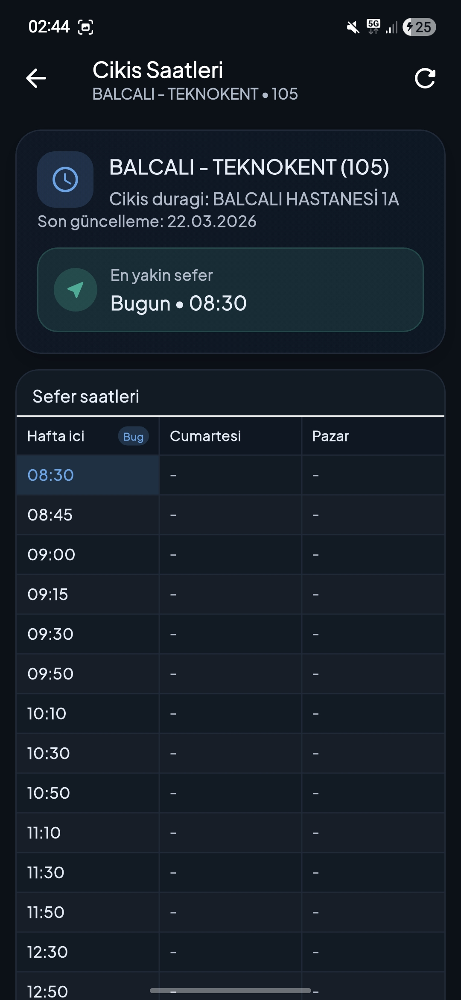
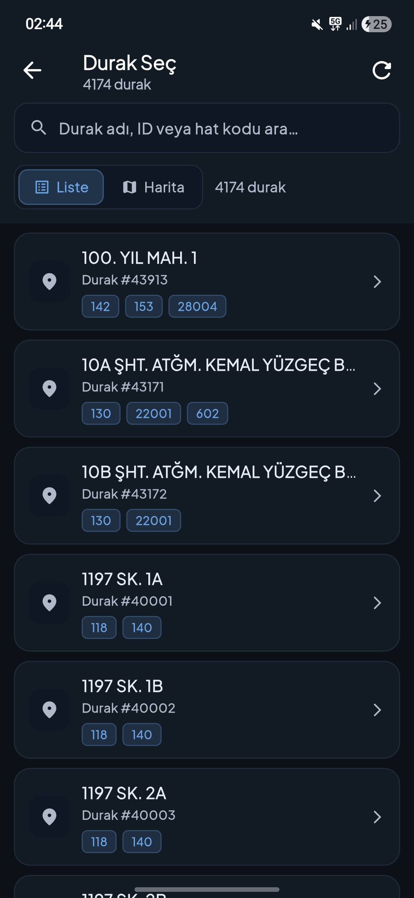
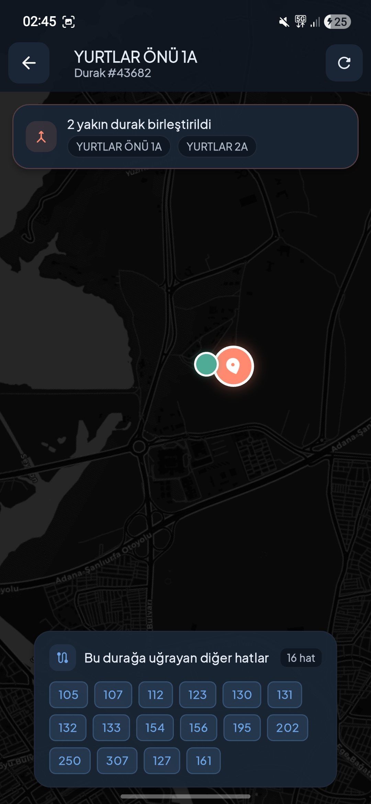
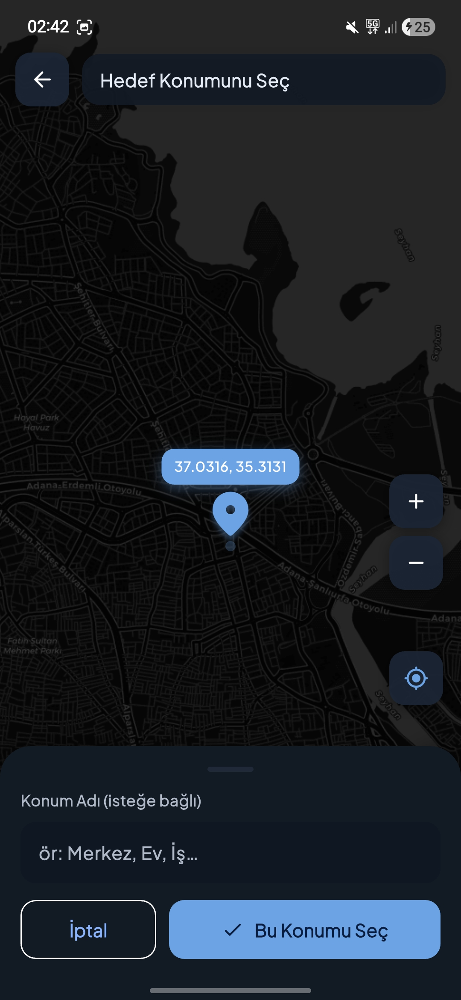
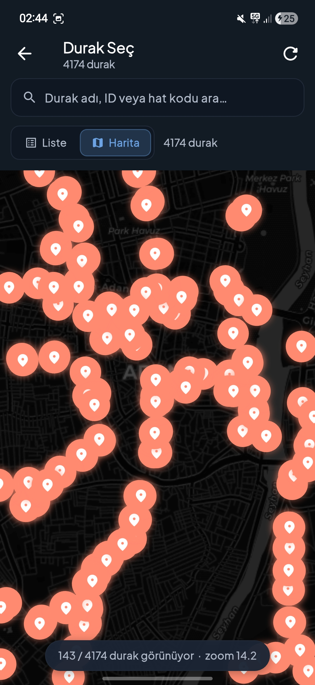

# AdanaBus

AdanaBus, Adana toplu taşıma kullanıcıları için canlı otobüs takibi, durak odaklı analiz ve anlık yolculuk planlama sunan Flutter tabanlı bir mobil uygulamadır.

Bu README, uygulamanın ne yaptığını, hangi ekranlardan oluştuğunu, veriyi nasıl işlediğini ve projeyi nasıl çalıştıracağınızı tek yerde toplar.

## Ekran Görüntüleri

### Ana kullanım akışı

| Ana Sayfa | Hatlar | Hat Detay |
| --- | --- | --- |
|  |  |  |

| Hat Saatleri | Durak Liste | Durak Detay |
| --- | --- | --- |
|  |  |  |

### Harita ve seçim akışı

| Harita Seçim | Durak Harita |
| --- | --- |
|  |  |

## İçindekiler

- [Öne Çıkanlar](#öne-çıkanlar)
- [Ekranlar](#ekranlar)
- [Ekran Görüntüleri](#ekran-görüntüleri)
- [Teknik Yapı](#teknik-yapı)
- [Veri Kaynakları](#veri-kaynakları)
- [Kurulum](#kurulum)
- [Uyarılar](#uyarılar-ve-bilinen-sınırlar)

## Öne Çıkanlar

- Canlı otobüs verisini alır ve harita üzerinde gösterir.
- Hat detayında güzergah, duraklar ve yaklaşan araç durumlarını bir araya getirir.
- Durak detayında yakın durakları birleştirerek daha anlamlı bir görünüm sağlar.
- Başlangıç ve hedefe göre anlık yolculuk seçenekleri üretir.
- Favori hat, favori durak ve rota kayıtlarını cihazda saklar.
- API alan adı farklılıklarına karşı dayanıklı bir parser yaklaşımı kullanır.

## Ekranlar

### Ana Sayfa

- Favorileri ve en yakın durak bilgisini gösterir.
- GPS ile konum alır ve en yakın durağı hesaplar.
- Durak kartı üzerinden detay ekrana geçiş sağlar.

### Hatlar

- Hat arama ve listeleme.
- Hat detayında gidiş-dönüş yönüne göre rota izleme.
- Canlı araç işaretleri ve yaklaşan sefer bilgisi.

### Durak Detay

- Seçili durağa yaklaşan hatları kartlar halinde gösterir.
- Haritada seçili hatta göre yaklaşma ve devam rotasını çizer.
- Birbirine yakın durakları tek grup olarak ele alır.
- Gruptaki durakları üstte toplu bilgi kartında listeler.

### Yolculuk Planlama

- Başlangıç ve hedefi GPS ya da harita seçimiyle alır.
- Canlı veriyi zaman hesabıyla birleştirerek en hızlı seçenekleri sıralar.
- Sonuçları rota önizleme haritası ile destekler.

### Favoriler

- Favori hat, favori durak ve favori rota yönetimi sağlar.
- Yerel depolama ile uygulama yeniden açıldığında veriyi korur.

## Teknik Yapı

Uygulamada öne çıkan teknik parçalar:

- Canlı veri yenileme: belirli aralıklarla veri çekip arayüzü güncelleme.
- GPS tabanlı yakınlık hesapları: iki koordinat arası mesafe ölçümü ve en yakın durak bulma.
- Durak kümeleme: seçili durağı merkez alarak 300 m içindeki durakları birleştirme.
- Rota eşleme: Kentkart path noktalarında seçili durağa en yakın segmenti bulma.
- Yaklaşan araç filtreleme: seçili durağa henüz gelmemiş araçları ayıklama.
- ETA tahmini: araç-durak mesafesinden dakika tahmini üretme.
- Akıllı yolculuk puanlama: yürüme, bekleme ve toplam süreyi birlikte değerlendirme.
- Dayanıklı parser: API alan adı farklılıklarına toleranslı çözümleme.

## Veri Kaynakları

Uygulama veriyi iki ana kaynaktan alır.

### Akıllı Kent API

- Token alma: https://akillikentapi.adana.bel.tr/api/token
- Canlı otobüsler: https://akillikentapi.adana.bel.tr/api/buses
- Yakın duraklar: https://akillikentapi.adana.bel.tr/api/nearByStops
- Durak saatleri (BusId): https://akillikentapi.adana.bel.tr/api/stopBusTimeBusId

### Kentkart Path API

- Hat-güzergah bilgisi: https://service.kentkart.com/rl1/api/sep/pathInfo

### Veri Akışı

1. Uygulama token alır.
2. Canlı otobüs listesini çeker.
3. Gerekli ekranda hat ve yön bazlı path verisini çeker.
4. Durak, hat ve otobüs verisini birleştirip arayüz katmanında işler.
5. Gerekli durumda fallback uygular veya son geçerli veriyi korur.

## Kurulum

1. Flutter ortamını kurun.
2. Projeyi klonlayın.
3. Bağımlılıkları yükleyin:

```bash
flutter pub get
```

4. Uygulamayı çalıştırın:

```bash
flutter run
```

İsteğe bağlı olarak API bilgilerini `dart-define` ile gönderebilirsiniz:

```bash
flutter run --dart-define=ADANA_EMAIL=mail --dart-define=ADANA_PASSWORD=sifre --dart-define=KENTKART_TOKEN=token
```

## Uyarılar ve Bilinen Sınırlar

- API servislerindeki geçici yavaşlama veya kesinti canlı veri tarafında gecikme oluşturabilir.
- Konum izni olmadan yakın durak ve GPS tabanlı planlama özellikleri sınırlı çalışır.
- ETA değerleri tahmindir; trafik yoğunluğu ve operasyonel değişiklikler fark yaratabilir.
- Harita verisi OpenStreetMap katmanına bağlıdır; anlık görüntü farklılıkları olabilir.

## Güvenlik Notu

- Üretim dağıtımında sabit kimlik bilgisi kullanılmamalı, güvenli yapılandırma tercih edilmelidir.
- Kimlik bilgileri sürüm kontrolüne açık şekilde eklenmemelidir.

## Yol Haritası

- Ekran görüntüleri ve kullanım GIF'leri genişletilecek.
- Daha detaylı teknik mimari diyagramı eklenecek.
- Test kapsamı ve CI notları eklenecek.
- Bildirimler, daha gelişmiş rota karşılaştırması ve performans optimizasyonları eklenecek.

## Lisans

Lisans bilgisi eklenecek.
